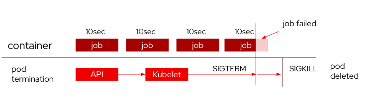
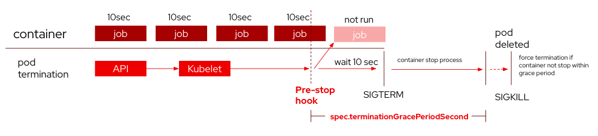

- [OpenShift PreStop Hook for Application termination with no data loss](#openshift-prestop-hook-for-application-termination-with-no-data-loss)
  - [Scenario](#scenario)
  - [Solution Idea](#solution-idea)
  - [Example of using Pre-Stop Hook in OpenShift Deployment](#example-of-using-pre-stop-hook-in-openshift-deployment)
    - [Deployment files](#deployment-files)
      - [Description](#description)
      - [Type](#type)
      - [Example :  using sleep method to have container wait on `preStop` hook with `terminationGracePeriodSeconds` set](#example---using-sleep-method-to-have-container-wait-on-prestop-hook-with-terminationgraceperiodseconds-set)
      - [Example : deployment.yaml](#example--deploymentyaml)
    - [Test by Scenario](#test-by-scenario)
      - [Step](#step)
      - [Result](#result)

# OpenShift PreStop Hook for Application termination with no data loss

## Scenario

- Having Application running jobs in near-realtime job or required times to graceful shutdown



- problem is when doing deployment rolling or pod termination event there's still running application that's require job to be done. if pod do terminate immediately, last job of that container/pod will be failed. introducing data integrety problem

## Solution Idea



Before pod termination process begin, we can set lifecycle specification called
"pre-stop" hook to run specific command on container to do things listed

Pre-Stop Hook

- tell application to stop running new task

- wait for a number of times for current tasks to finish

When all pre-stop hook execution are done, kubelet will send SIGTERM to container to begin stop process. This process can control by terminationGracePeriodSecond to make sure pods are not stuck in terminating process

after `terminationGracePeriodSecond` , system send SIGKILL to force termination of container

## Example of using Pre-Stop Hook in OpenShift Deployment

### Deployment files

This is example of deployment using pre-stop hook in container spec

Syntax Component

.spec.ephemeralContainers[].lifecycle.preStop.exec

#### Description

> ExecAction describes a "run in container" action.

#### Type
> object

| Property  | Type  | Description |
| ------------- | ------------- | ------ |
| Command  | array (string) |  Command is the command line to execute inside the container, the working directory for the command is root ('/') in the container’s filesystem. The command is simply exec’d, it is not run inside a shell, so traditional shell instructions ('|', etc) won’t work. To use a shell, you need to explicitly call out to that shell. Exit status of 0 is treated as live/healthy and non-zero is unhealthy. |

#### Example :  using sleep method to have container wait on `preStop` hook with `terminationGracePeriodSeconds` set

```yaml
spec:
  terminationGracePeriodSeconds: 20
  containers:
  - name: "{{APP_NAME}}"
    lifecycle:
      preStop:
        exec:
          command: ["/bin/sh","-c","sleep 10"]
```


#### Example : deployment.yaml
```yaml

apiVersion: apps/v1
kind: Deployment
metadata:
  namespace: openshift
  name: 'nonstopjob'
spec:
  selector:
    matchLabels:
      app: nonstopjob
  replicas: 1
  template:
    metadata:
      labels:
        app: nonstopjob
    spec:
      containers:
        - name: nonstopjob
          image: nginx:latest
          ports:
              - containerPort: 80
          lifecycle:
            preStop:
              exec:
                command: ["bin/sh","-c","echo 'do something to prevent new job to run' > /proc/1/fd/1 && echo 'waiting current job to finish (10s)' > /proc/1/fd/1 && date +%T > /proc/1/fd/1 && sleep 10 && echo 'done waiting, terminating pod' > /proc/1/fd/1 && date +%T > /proc/1/fd/1"]
      terminationGracePeriodSeconds: 20
  strategy:
    type: RollingUpdate
    rollingUpdate:
      maxSurge: 25%
      maxUnavailable: 25%


```

### Test by Scenario
#### Step
1. create deployment 
```bash
$ oc apply -f deployment.yaml 
deployment.apps/nonstopjob configured
```

2. monitor running pod
```bash
$ oc get pods
NAME                          READY   STATUS    RESTARTS   AGE
nonstopjob-784c768b6f-fjn94   1/1     Running   0          52s
```

3. logs pod (follow)
```bash 
oc logs -f nonstopjob-784c768b6f-fjn94
```

```bash
/docker-entrypoint.sh: /docker-entrypoint.d/ is not empty, will attempt to perform configuration
/docker-entrypoint.sh: Looking for shell scripts in /docker-entrypoint.d/
/docker-entrypoint.sh: Launching /docker-entrypoint.d/10-listen-on-ipv6-by-default.sh
10-listen-on-ipv6-by-default.sh: info: Getting the checksum of /etc/nginx/conf.d/default.conf
10-listen-on-ipv6-by-default.sh: info: Enabled listen on IPv6 in /etc/nginx/conf.d/default.conf
/docker-entrypoint.sh: Sourcing /docker-entrypoint.d/15-local-resolvers.envsh
/docker-entrypoint.sh: Launching /docker-entrypoint.d/20-envsubst-on-templates.sh
/docker-entrypoint.sh: Launching /docker-entrypoint.d/30-tune-worker-processes.sh
/docker-entrypoint.sh: Configuration complete; ready for start up
2023/12/21 18:52:06 [notice] 1#1: using the "epoll" event method
2023/12/21 18:52:06 [notice] 1#1: nginx/1.25.3
2023/12/21 18:52:06 [notice] 1#1: built by gcc 12.2.0 (Debian 12.2.0-14) 
2023/12/21 18:52:06 [notice] 1#1: OS: Linux 5.14.0-284.41.1.el9_2.x86_64
2023/12/21 18:52:06 [notice] 1#1: getrlimit(RLIMIT_NOFILE): 1048576:1048576
2023/12/21 18:52:06 [notice] 1#1: start worker processes
2023/12/21 18:52:06 [notice] 1#1: start worker process 29
2023/12/21 18:52:06 [notice] 1#1: start worker process 30
2023/12/21 18:52:06 [notice] 1#1: start worker process 31
2023/12/21 18:52:06 [notice] 1#1: start worker process 32
2023/12/21 18:52:06 [notice] 1#1: start worker process 33
2023/12/21 18:52:06 [notice] 1#1: start worker process 34
2023/12/21 18:52:06 [notice] 1#1: start worker process 35
2023/12/21 18:52:06 [notice] 1#1: start worker process 36


```

4. open another shell, run command to scale down pods to `0` (simulating pod rolling )

```bash
oc scale deployment nonstopjob --replicas=0
```

5. review container's log before exit  ( before SIGQUIT )
```bash
$ oc logs -f nonstopjob-784c768b6f-fjn94
/docker-entrypoint.sh: /docker-entrypoint.d/ is not empty, will attempt to perform configuration
/docker-entrypoint.sh: Looking for shell scripts in /docker-entrypoint.d/
/docker-entrypoint.sh: Launching /docker-entrypoint.d/10-listen-on-ipv6-by-default.sh
10-listen-on-ipv6-by-default.sh: info: Getting the checksum of /etc/nginx/conf.d/default.conf
10-listen-on-ipv6-by-default.sh: info: Enabled listen on IPv6 in /etc/nginx/conf.d/default.conf
/docker-entrypoint.sh: Sourcing /docker-entrypoint.d/15-local-resolvers.envsh
/docker-entrypoint.sh: Launching /docker-entrypoint.d/20-envsubst-on-templates.sh
/docker-entrypoint.sh: Launching /docker-entrypoint.d/30-tune-worker-processes.sh
/docker-entrypoint.sh: Configuration complete; ready for start up
2023/12/21 18:52:06 [notice] 1#1: using the "epoll" event method
2023/12/21 18:52:06 [notice] 1#1: nginx/1.25.3
2023/12/21 18:52:06 [notice] 1#1: built by gcc 12.2.0 (Debian 12.2.0-14) 
2023/12/21 18:52:06 [notice] 1#1: OS: Linux 5.14.0-284.41.1.el9_2.x86_64
2023/12/21 18:52:06 [notice] 1#1: getrlimit(RLIMIT_NOFILE): 1048576:1048576
2023/12/21 18:52:06 [notice] 1#1: start worker processes
2023/12/21 18:52:06 [notice] 1#1: start worker process 29
2023/12/21 18:52:06 [notice] 1#1: start worker process 30
2023/12/21 18:52:06 [notice] 1#1: start worker process 31
2023/12/21 18:52:06 [notice] 1#1: start worker process 32
2023/12/21 18:52:06 [notice] 1#1: start worker process 33
2023/12/21 18:52:06 [notice] 1#1: start worker process 34
2023/12/21 18:52:06 [notice] 1#1: start worker process 35
2023/12/21 18:52:06 [notice] 1#1: start worker process 36
do something to prevent new job to run
waiting current job to finish (10s)
18:57:02
done waiting, terminating pod
18:57:12
2023/12/21 18:57:12 [notice] 1#1: signal 3 (SIGQUIT) received, shutting down
2023/12/21 18:57:12 [notice] 30#30: gracefully shutting down
2023/12/21 18:57:12 [notice] 29#29: gracefully shutting down
2023/12/21 18:57:12 [notice] 31#31: gracefully shutting down
2023/12/21 18:57:12 [notice] 33#33: gracefully shutting down
2023/12/21 18:57:12 [notice] 31#31: exiting
2023/12/21 18:57:12 [notice] 29#29: exiting
2023/12/21 18:57:12 [notice] 35#35: gracefully shutting down
2023/12/21 18:57:12 [notice] 36#36: gracefully shutting down
2023/12/21 18:57:12 [notice] 33#33: exiting
2023/12/21 18:57:12 [notice] 35#35: exiting
2023/12/21 18:57:12 [notice] 36#36: exiting
2023/12/21 18:57:12 [notice] 30#30: exiting
2023/12/21 18:57:12 [notice] 31#31: exit
2023/12/21 18:57:12 [notice] 33#33: exit
2023/12/21 18:57:12 [notice] 29#29: exit
2023/12/21 18:57:12 [notice] 36#36: exit
2023/12/21 18:57:12 [notice] 30#30: exit
2023/12/21 18:57:12 [notice] 32#32: gracefully shutting down
2023/12/21 18:57:12 [notice] 32#32: exiting
2023/12/21 18:57:12 [notice] 35#35: exit
2023/12/21 18:57:12 [notice] 32#32: exit
2023/12/21 18:57:12 [notice] 34#34: gracefully shutting down
2023/12/21 18:57:12 [notice] 34#34: exiting
2023/12/21 18:57:12 [notice] 34#34: exit
2023/12/21 18:57:12 [notice] 1#1: signal 17 (SIGCHLD) received from 35
2023/12/21 18:57:12 [notice] 1#1: worker process 32 exited with code 0
2023/12/21 18:57:12 [notice] 1#1: worker process 35 exited with code 0
2023/12/21 18:57:12 [notice] 1#1: signal 29 (SIGIO) received
2023/12/21 18:57:12 [notice] 1#1: signal 17 (SIGCHLD) received from 32
2023/12/21 18:57:12 [notice] 1#1: signal 17 (SIGCHLD) received from 31
2023/12/21 18:57:12 [notice] 1#1: worker process 31 exited with code 0
2023/12/21 18:57:12 [notice] 1#1: signal 29 (SIGIO) received
2023/12/21 18:57:12 [notice] 1#1: signal 17 (SIGCHLD) received from 29
2023/12/21 18:57:12 [notice] 1#1: worker process 29 exited with code 0
2023/12/21 18:57:12 [notice] 1#1: signal 29 (SIGIO) received
2023/12/21 18:57:12 [notice] 1#1: signal 17 (SIGCHLD) received from 30
2023/12/21 18:57:12 [notice] 1#1: worker process 30 exited with code 0
2023/12/21 18:57:12 [notice] 1#1: signal 29 (SIGIO) received
2023/12/21 18:57:12 [notice] 1#1: signal 17 (SIGCHLD) received from 33
2023/12/21 18:57:12 [notice] 1#1: worker process 33 exited with code 0
2023/12/21 18:57:12 [notice] 1#1: signal 17 (SIGCHLD) received from 36
2023/12/21 18:57:12 [notice] 1#1: worker process 34 exited with code 0
2023/12/21 18:57:12 [notice] 1#1: worker process 36 exited with code 0
2023/12/21 18:57:12 [notice] 1#1: exit

```

#### Result 
We can use `preStop` method to trigger application pause, wait for current task to finish and then begin pod termination process


```bash
2023/12/21 18:52:06 [notice] 1#1: start worker process 36
do something to prevent new job to run
waiting current job to finish (10s)
18:57:02
done waiting, terminating pod
18:57:12
2023/12/21 18:57:12 [notice] 1#1: signal 3 (SIGQUIT) received, shutting down
```

> [!CAUTION]
> 
> Using command `sleep` to pause termination are in fixed seconds, need to discuss with developer on how long do we need to wait  befor begin pod termination